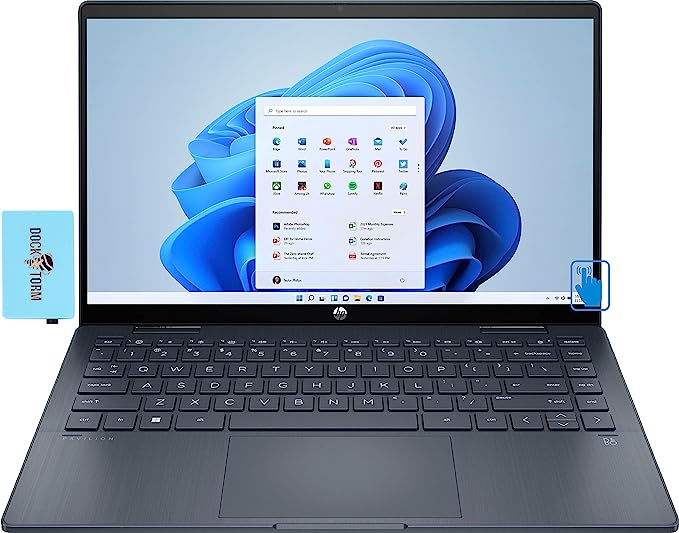
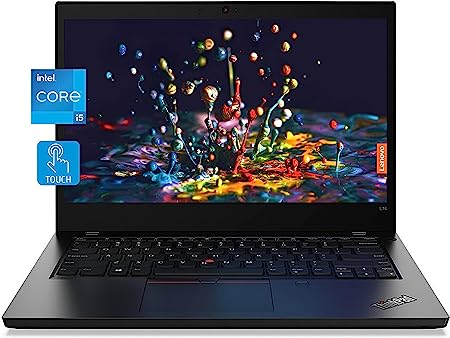

# Recommendation
CFO's Requested Laptop

**option 1 CFO's Requested Laptop**

Specification
1. CPU: AMD Athlon Silver
2. Processor: AMD Athlon Silver 7120U
3. RAM: 4GB 
4. Hard Drive Storage: 128GB SSD
5. Price: $229.99

**Amanuel's option 1 Recommended Laptop**

Specification
1. CPU: Pavillon 14-ek0013dx
2. Processor: i3-1215U 1.20GHz 
3. RAM: 8GB
4. Hard Drive Storage: 256GB SSD
5. Price: $500

**Three Reasons why this Laptop is better**

1. Faster Processor: The HP Pavilion comes with an Intel i3-1215U processor clocked at 1.20GHz. Compared to the AMD Athlon Silver 7120U in the CFO's requested laptop, the i3 processor is generally more powerful and efficient, providing better performance for various computing tasks, including multitasking, web browsing, and productivity applications.

2. More RAM:The HP Pavilion is equipped with 8GB of RAM, which is twice the amount of RAM found in the CFO's requested laptop. 

3. Larger SSD Storage: A larger SSD allows you to store more files, applications, and data, offering additional flexibility and reducing the need for external storage solutions.
4. primary resources: https://www.amazon.com/Newest-HP-Pavilion-i3-1215U-Bluetooth/dp/B0B9QMZZJF/ref=sr_1_2?crid=HAWZMCOTJG2K&keywords=hp+computer&qid=1686060064&refinements=p_36%3A50000-75000&rnid=2421885011&s=pc&sprefix=hp+computer%2Caps%2C141&sr=1-2&ufe=app_do%3Aamzn1.fos.2b70bf2b-6730-4ccf-ab97-eb60747b8daf

   **Amanuel's option 2 Recommended Laptop**

Specification
1. CPU: Intel Core i5-1135G7 @ 2.40GHz 9942
2. Processor: 11th Generation Intel Core i5-1135G7 2.4GHz
3. RAM: 16GB
4. Hard Drive Storage: 512GB NVMe SSD
5. Price: $629

**Three Reasons why this Laptop is better**

1. More Powerful Processor: The Lenovo ThinkPad comes with an Intel Core i5-1135G7 processor, which is part of the 11th Generation Intel Core series. Compared to the AMD Athlon Silver 7120U in the CFO's requested laptop and offers higher clock speeds and better performance.

2. Increased RAM Capacity: The 16GB RAM enables smoother multitasking, allows you to work with more memory-intensive applications simultaneously, and enhances overall system responsiveness.
 
3. Larger and Faster SSD Storage: The Lenovo ThinkPad boasts a 512GB NVMe SSD, providing twice the storage capacity. Additionally, NVMe SSDs offer significantly faster read and write speeds compared to regular SATA SSDs.
4. primary resources: https://www.amazon.com/dp/B0C8X1S97P/ref=sspa_dk_detail_1?pd_rd_i=B0C8X1S97P&pd_rd_w=Nf9uc&content-id=amzn1.sym.0d1092dc-81bb-493f-8769-d5c802257e94&pf_rd_p=0d1092dc-81bb-493f-8769-d5c802257e94&pf_rd_r=RWY6KRXDTSYCZKS8QHYC&pd_rd_wg=NFwPz&pd_rd_r=9a086b4f-05e2-4862-9f60-7db66522cf36&s=pc&sp_csd=d2lkZ2V0TmFtZT1zcF9kZXRhaWwy&th=1

**Overall recommendation**

The Lenovo ThinkPad is the overall suggested option when specs and cost are taken into account. With the Intel Core i5 processor, double the RAM for easier multitasking, and a bigger and faster NVMe SSD for better storage and data access, it provides a noticeable performance gain. Even though it is the most expensive of the three, the improved performance and features make it worth the money, especially for customers who need additional computational power.

Users with a moderate budget might consider the HP Pavilion since it strikes a good mix between performance and price. However, the Lenovo ThinkPad is the suggested choice for individuals looking for a laptop with higher performance and future-proof features.

remote_theme: Cayman
